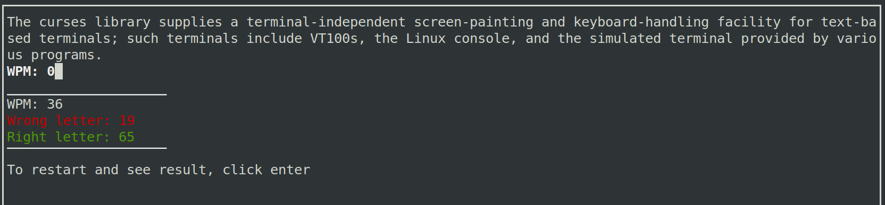

# Typing Speed Test — Version 2

## Overview
This is the **second edition** of the **Typing Speed Test** project — now featuring **improved mechanics, a refined menu system, and enhanced user interaction**.  
It’s a terminal-based application built with **Python** and the **`curses`** library that allows you to test and improve your typing speed directly in the console.

## Features
- **Two modes:**
  - *WPM Live* — shows your Words Per Minute (WPM) in real-time as you type.  
  - *Typing in Time* — measures how long it takes you to finish the text.  
- **Dynamic color feedback:**
  - Green for correct characters  
  - Red for incorrect characters  
- **Animated menus and transitions**
- **Live updates** for time or WPM display
- **Simple restart and result view** after each test
- **Text loaded from an external file (`text.txt`)**



## Requirements
- Python **3.8+** (Windows)
- Python 3.x (Linux, macOS)
- Terminal that supports `curses`  
  (Works best on Linux, macOS, or Windows with WSL or Git Bash)

## Installation
1. Clone this repository or download the script.
2. Make sure you have a `text.txt` file in the same directory with the text you want to type.
3. Run the script:
   ```bash
   python3 typing_speed_test.py

## Controls
- Press **1** — Start WPM Live mode
- Press **2** — Start Typing in Time mode
- **Backspace** — Correct mistakes while typing 
- **Enter** — Restart after completing a test

## Notes
- Minimum terminal size required: **20x100**
- The script dynamically displays WPM or time depending on the chosen mode.
- Works best in full-screen terminal mode for proper display.

## Author
- Created by **Piotr Frasik**
- Second edition with improved mechanics, menu design, and usability.
